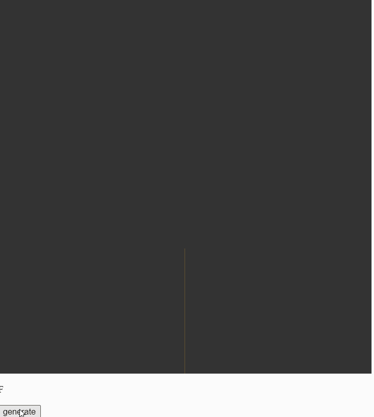
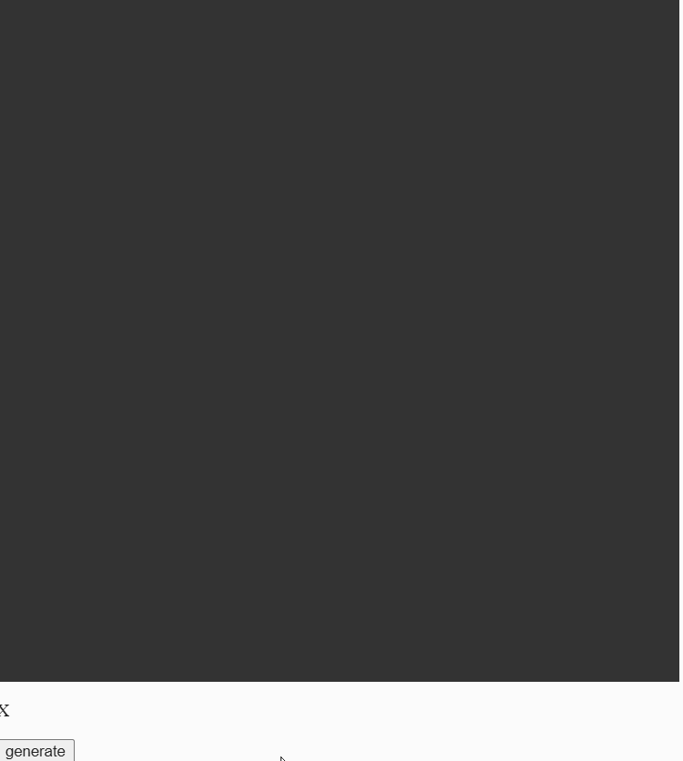
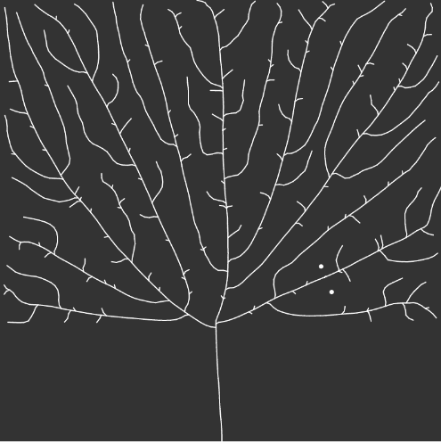
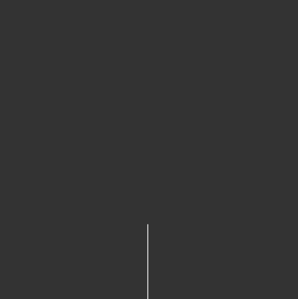

# Procedural Plant

## L-System plant: 

### Plant 1: 



Grammar: 
```js
var angle = 25 * 0.0174533;
var axiom = "F";
var sentence = axiom;
var len = 200;

var rules = [];

rules[0] = {
    a: "F",
    b: "FF+[+F-F-F]-[-F+F+F]"  
}
```


### Plant 2:


Grammar: 
```js
var angle = 25 * 0.0174533;
var axiom = "X";
var sentence = axiom;
var len = 250;

var rules = [];

rules[0] = {
    a: "X",
    b: "F+[[X]-X]-F[-FX]+X"  
}

rules[1] = {
    a: "F",
    b: "FF"  
}
```

### Plant 3:



Grammar: 
```js
var angle = 15 * 0.0174533;
var axiom = "X";
var sentence = axiom;
var len = 250;

var rules = [];

rules[0] = {
    a: "X",
    b: "+[[XX]-X]-FF[-F]+X"  
}

rules[1] = {
    a: "F",
    b: "FF"  
}
```

**Source code**: https://editor.p5js.org/zixin96/sketches/7QHyaADwV

## Space Colonization Algorithm



**Source code**: https://github.com/zixin96/ProceduralPlant

## Recursive plant: 



**Source code**: https://editor.p5js.org/zixin96/sketches/OfH6Ck3yi

## References

[1] CodingTrain. Coding Challenge #14-17.
    Used under MIT License.
    https://github.com/CodingTrain/website